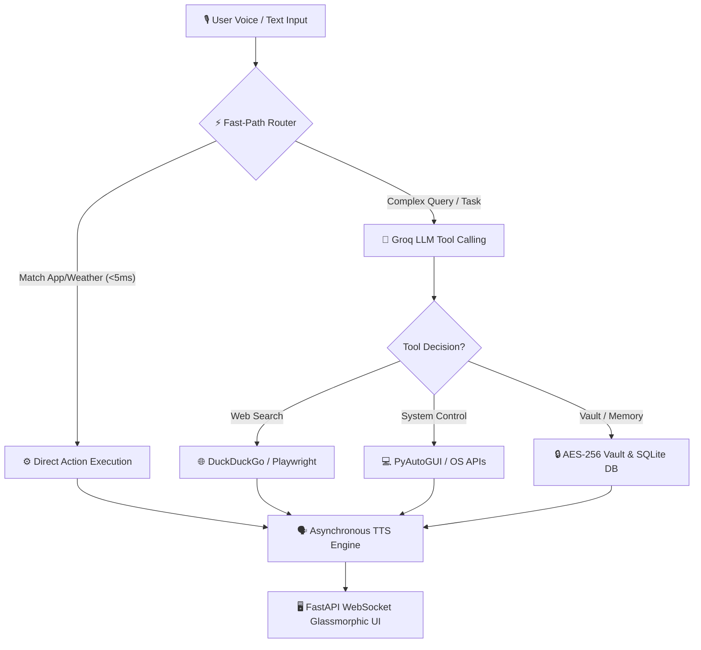

# 🎙️ Nova — Advanced Local-First AI Voice Assistant

[](https://www.python.org/)
[](https://fastapi.tiangolo.com/)
[](https://groq.com/)
[](https://cryptography.io/)
[]()
[](https://oasisinfobyte.com/)

> **Nova** is an autonomous, local-first, privacy-focused AI Voice Assistant engineered with **Python**, **FastAPI WebSockets**, **Groq LLM Tool Calling**, **Playwright Web Automation**, and **PyAutoGUI**. Designed to combine sub-second desktop execution with high-level cognitive reasoning, Nova can control your operating system, automate browser tasks, answer complex questions, fetch live weather, set reminders, and manage secure credentials—all wrapped inside a modern **Glassmorphic SPA Dashboard UI**.

Developed for the **Oasis Infobyte Virtual Internship Program (OIBSIP)** under the **Python Development** track.

---

## 🖼️ Dashboard Interface Preview


---

## 📋 Table of Contents
1. [🌟 Key Features](#-key-features)
2. [⚙️ Clear Steps to Run Locally](#️-clear-steps-to-run-locally)
3. [📐 System Architecture & Flow](#-system-architecture--flow)
4. [📁 Folder & Module Structure](#-folder--module-structure)
5. [⚡ Fast-Path & AI Capabilities](#-fast-path--ai-capabilities)
6. [🧪 Running Unit Tests](#-running-unit-tests)
7. [🔒 Privacy & Security Disclosures](#-privacy--security-disclosures)
8. [👤 Author & Acknowledgments](#-author--acknowledgments)

---

## 🌟 Key Features

### ⚡ 1. Sub-Second Fast-Path Router (< 5ms Execution)
- **Instant Launcher**: Bypasses cloud LLM latency for common desktop commands (*"open Chrome"*, *"launch Notepad"*, *"open YouTube"*), launching target applications in **under 5 milliseconds**.
- **Instant Weather Interceptor**: Intercepts weather inquiries (*"weather in Lahore"*, *"weather of London"*) and responds instantly using direct API lookups (< 100ms response).

### 🧠 2. Autonomous LLM Tool Reasoning (Groq Llama 3.1 8B)
- **Function Calling Engine**: Uses Groq's high-speed `llama-3.1-8b-instant` model to dynamically reason over user requests and select appropriate system tools (`web_search`, `browser_action`, `set_reminder`, `get_weather`, `manage_credentials`).
- **Episodic Memory**: Automatically persists chat history and key user facts in a local SQLite database (`data/nova_memory.db`).

### 🎙️ 3. Optimized English Speech Intelligence (`en-US`)
- **Micro-Tuned STT**: Uses Google Web Speech API tuned with a fast `0.6s` silence threshold (`pause_threshold = 0.6s`), eliminating recording latency and speech hallucinations.
- **Threaded Non-Blocking TTS**: Uses Windows SAPI5 voice engine (`pyttsx3`) running inside background daemon threads with `pythoncom.CoInitialize()`, ensuring speech output never blocks the UI or application execution.

### 🔒 4. AES-256 Encrypted Local Credentials Vault
- **Fernet Cryptography**: Safely encrypts sensitive user passwords and web credentials locally in `data/vault.json` using **AES-256 Fernet symmetric keys**.
- **Auto-Login Integration**: Interacts with Playwright browser automation to automatically log into authenticated platforms.

### 💻 5. Modern Glassmorphic SPA Dashboard UI
- **Single Page Interface**: Styled with dark glassmorphism, responsive CSS grid/flex layouts, modern typography (Inter/Outfit), and glowing background accents.
- **Interactive Mic Orb & Waveforms**: Central glowing microphone orb with real-time CSS audio visualizer waveforms matching the assistant's state (`idle`, `listening`, `processing`, `speaking`).
- **Real-Time WebSocket Stream**: Bi-directional FastAPI WebSocket communication pushing status updates, activity logs, memory stats, and speech transcripts instantly.

---

## ⚙️ Clear Steps to Run Locally

Follow these step-by-step instructions to get Nova running on your computer:

### Step 1: Clone the Repository
Open your terminal or PowerShell and run:
```bash
git clone https://github.com/hanzlikhan/OIBSIP.git
cd OIBSIP/Python-Task1-VoiceAssistant
```

### Step 2: Create a Virtual Environment
Create an isolated Python virtual environment:

**On Windows (PowerShell / Command Prompt):**
```powershell
python -m venv venv
.\venv\Scripts\activate
```

**On macOS / Linux:**
```bash
python3 -m venv venv
source venv/bin/activate
```

### Step 3: Install Required Dependencies
Install all required Python dependencies:
```bash
pip install -r requirements.txt
```

### Step 4: Configure Environment Variables
Create your local `.env` configuration file:

**On Windows PowerShell:**
```powershell
copy .env.example .env
```

**On macOS / Linux:**
```bash
cp .env.example .env
```

Open `.env` in any text editor and add your Groq API key:
```ini
# Groq API Key (For autonomous LLM reasoning)
GROQ_API_KEY=your_groq_api_key_here

# OpenWeatherMap API Key (Optional: Falls back to simulated weather if empty)
OPENWEATHERMAP_API_KEY=your_weather_api_key_here
```
> 💡 *Note: If you don't have an OpenWeather API key, Nova will automatically simulate live weather data so you can test immediately!*

### Step 5: Run Nova Voice Assistant
Execute the main application launcher:
```bash
python main.py
```

Nova will boot the server on `http://127.0.0.1:8000` and **automatically open your default web browser** to display the dark glassmorphic dashboard interface! 

Click the central mic orb or press `Spacebar` to start speaking!

---

## 📐 System Architecture & Flow



---

## 📁 Folder & Module Structure

```text
Python-Task1-VoiceAssistant/
├── dashboard.png             # UI Dashboard screenshot preview
├── actions/                  # Modular Voice & Automation Action Handlers
│   ├── __init__.py
│   ├── base.py               # Abstract Base Class for system actions
│   ├── device_control.py     # OS app launcher, PyAutoGUI screenshots & shortcuts
│   ├── email_sender.py       # Simulated outbox email composer & SMTP handler
│   ├── knowledge.py          # Wikipedia general knowledge client
│   ├── reminder.py           # Threaded timers with Web Audio & system alerts
│   ├── search.py             # DuckDuckGo web search trigger
│   └── weather.py            # OpenWeatherMap API fetcher & fallback simulator
├── config/                   # Configuration & Custom Commands
│   ├── __init__.py
│   ├── commands.json         # Storage for custom user-defined triggers
│   └── settings.py           # Environment variables & runtime settings manager
├── core/                     # Core Engine Architecture
│   ├── __init__.py
│   ├── assistant.py          # Master Orchestrator (Fast-Path router & action dispatcher)
│   ├── audio.py              # Pyttsx3 TTS voice engine & SpeechRecognition STT
│   ├── brain.py              # Groq LLM function calling reasoner
│   ├── memory.py             # SQLite episodic interaction memory manager
│   ├── nlu.py                # Regex slot filler & intent categorizer
│   └── vault.py              # AES-256 Fernet encrypted key-value credential vault
├── data/                     # Persistent Local Data Storage
│   ├── action_log.jsonl      # Transparent execution audit trail log
│   ├── nova_memory.db        # Local SQLite interaction memory database
│   ├── outbox/               # Local draft emails (.txt files in debug mode)
│   └── screenshots/          # Screen captures taken by voice commands
├── gui/                      # Glassmorphic Web Dashboard Interface
│   ├── static/
│   │   ├── css/style.css     # Glassmorphism UI styling, dark mode & animations
│   │   ├── js/app.js         # WebSocket client handler & dynamic UI renderer
│   │   └── assets/           # UI icons & sound effects
│   ├── templates/
│   │   └── index.html        # Single Page Dashboard HTML markup
│   └── server.py             # FastAPI server application with WebSocket endpoint
├── tests/                    # Unit Test Suite
│   ├── __init__.py
│   ├── test_actions.py       # Action module unit tests
│   ├── test_nlu.py           # Intent parsing unit tests
│   └── test_vault.py         # AES-256 vault encryption unit tests
├── .env.example              # Template for environment variables
├── Dashboard.md              # Project status & features tracking dashboard
├── main.py                   # Main entry point (Launches FastAPI & auto-opens browser)
├── PRESENTATION_SLIDES.md    # Executive presentation slide deck outline
├── PROJECT_EXPLANATION.md   # Beginner-friendly line-by-line guide & presentation notes
├── SINGLE_SLIDE.html         # Interactive standalone presentation slide HTML
└── requirements.txt          # Python dependency specifications
```

---

## ⚡ Fast-Path & AI Capabilities

| Category | Voice Command Example | Action Performed | Response Time |
| :--- | :--- | :--- | :---: |
| **Instant Launch** | *"Open Chrome"* / *"Launch Slack"* | Spawns target OS application directly | **< 5 ms** |
| **Instant Weather** | *"Weather in Lahore"* | Fetches temperature, sky condition & humidity | **< 100 ms** |
| **Web Navigation** | *"Open YouTube"* / *"Visit GitHub"* | Opens target URL in default web browser | **< 5 ms** |
| **General QA** | *"Who is Alan Turing?"* | Groq LLM / Wikipedia factual search summary | **< 500 ms** |
| **System Diagnostics**| *"What's my CPU and RAM usage?"* | Interrogates `psutil` system metrics | **< 10 ms** |
| **Timers & Alarms** | *"Set a reminder for 10 seconds"* | Threaded countdown timer with sound alert | **Instant** |
| **Screen Capture** | *"Take a screenshot"* | Captures display via `pyautogui` to `data/screenshots/` | **< 50 ms** |

---

## 🧪 Running Unit Tests

The repository includes a comprehensive unit test suite covering actions, NLU intent classification, and AES-256 vault encryption.

To run the tests:
```bash
pytest
```
*Expected output: All 14 tests passing (`14 passed in < 3s`).*

---

## 🔒 Privacy & Security Disclosures

Nova is built from the ground up to respect user privacy:

1. **Zero Passive Listening**: The microphone is strictly closed by default. Audio capture is only triggered when you explicitly press the microphone orb or Spacebar.
2. **Encrypted Credentials**: Stored secrets and logins are encrypted using **AES-256 Fernet cryptography** inside `data/vault.json`.
3. **Local Action Audit Trail**: Every executed action (file access, application launches, screenshot captures) is appended to a local audit log at `data/action_log.jsonl`.
4. **No Third-Party Telemetry**: Your private data, recordings, and custom command histories stay on your local disk.

---

## 👤 Author & Acknowledgments

* **Author**: Muhammad Hanzla
* **Program**: Oasis Infobyte Virtual Internship Program (OIBSIP)
* **Track**: Python Development (Task 1: AI Voice Assistant)
* **Repository**: [hanzlikhan/OIBSIP](https://github.com/hanzlikhan/OIBSIP)

*Special thanks to the **Oasis Infobyte** team for creating an inspiring platform for practical Python development!*
