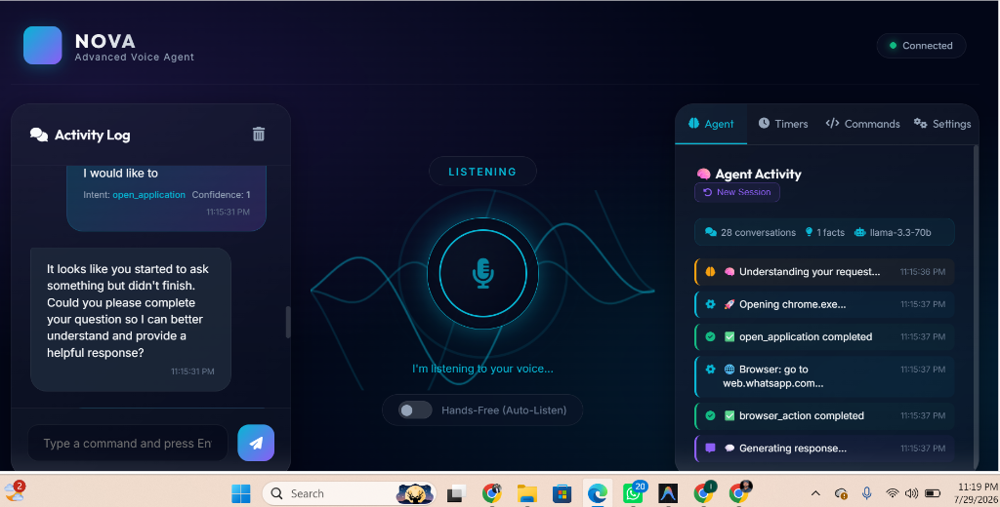

# 🚀 Oasis Infobyte Virtual Internship Program (OIBSIP)

Welcome to the official repository for my **Oasis Infobyte Internship (OIBSIP)** projects in the **Python Development** track.

---

## 🖼️ Task 1 UI Preview: Nova Voice Assistant



---

## 📁 Projects Overview

| Task | Project Name | Description | Tech Stack | Status |
| :--- | :--- | :--- | :--- | :---: |
| **Task 1** | [**Python-Task1-VoiceAssistant**](./Python-Task1-VoiceAssistant/) | **Nova: Advanced Local-First AI Voice Assistant** with Fast-Path launcher, Groq LLM tool calling, AES-256 encrypted vault, Playwright browser automation, and Glassmorphic Web Dashboard UI. | Python, FastAPI WebSockets, Groq LLM, Playwright, PyAutoGUI, HTML5/CSS3 | **Completed** ✅ |

---

## ⚙️ Quick Start (Run Locally)

```bash
# 1. Clone repo
git clone https://github.com/hanzlikhan/OIBSIP.git
cd OIBSIP/Python-Task1-VoiceAssistant

# 2. Virtual environment & dependencies
python -m venv venv
.\venv\Scripts\activate
pip install -r requirements.txt

# 3. Environment configuration
copy .env.example .env

# 4. Launch Nova!
python main.py
```

👉 **[Read the Full Task 1 Documentation & Architecture](./Python-Task1-VoiceAssistant/README.md)**

---

## 👤 Author Information

* **Author**: Muhammad Hanzla
* **Track**: Python Development
* **Program**: Oasis Infobyte Virtual Internship Program (OIBSIP)
* **GitHub Repository**: [hanzlikhan/OIBSIP](https://github.com/hanzlikhan/OIBSIP)
